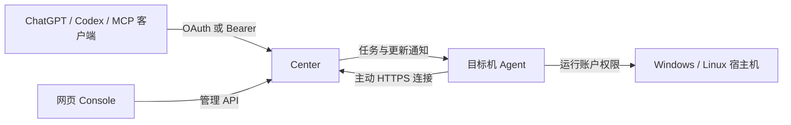

# Remote Control MCP

**让 ChatGPT、Codex 或其他 MCP 客户端操作你自己的远程机器。**

Remote Control MCP（RCM）是一个自托管的远程控制服务，把 Windows / Linux 机器上的命令、文件、桌面和浏览器能力提供给 MCP 客户端。你可以在对话里提出任务，让模型选择机器、执行操作、观察进度并取回结果，也可以直接通过网页 Console 管理机器和文件。

项目以“一人管理自己的多台机器”为主要场景。机器与工具权限按每张连接凭证配置，执行过程保留任务、结果和审计记录。RCM 提供执行能力；模型由你使用的 MCP 客户端提供。

## 能做什么

| 场景 | 使用方式 |
| --- | --- |
| 远程开发与排障 | 执行命令、检查服务、查看编译/测试日志；短命令直接返回结果，长任务持续观察。 |
| 文件管理与成果交付 | 浏览和搜索目录、编辑文本、批量复制/移动/删除、压缩/解压、上传/下载报告和数据文件。 |
| 桌面操作 | 查看屏幕与窗口、启动程序、点击、输入、快捷键和剪贴板操作。 |
| 浏览器任务 | 通过 Camoufox 打开页面、观察内容、交互和截图，浏览器按任务需要启动。 |
| 多机管理与更新 | 在 Console 查看在线状态、版本、任务和升级证据；发布后由 Center 分批调谐 Agent。 |

例如，可以在已连接的客户端中说：

> 找到开发机桌面上的大乐透 Excel，确认文件名和大小，再把完整文件取回来。
>
> 查看 Debian 上服务的最新报错，只读取日志尾部；如果任务还没结束，继续跟随原任务。
>
> 把指定目录复制到新的备份目录，完成后检查结果。

## 如何工作



| 组件 | 职责 |
| --- | --- |
| Center | 提供 MCP、OAuth 和管理 API；检查凭证权限，保存任务与结果，协调 Agent 更新。 |
| Console | 管理机器、连接凭证、任务、文件、审计记录和更新状态。 |
| Agent | 在目标机上常驻，领取任务并回传状态、日志和文件；按本机账户权限执行。 |
| Desktop / Browser / Helper | 分别处理登录会话中的桌面、按需浏览器与本机组件升级。 |

Agent 默认通过 HTTPS 长轮询主动连接 Center，任务或更新到来时立即唤醒等待中的请求。Agent 的正常运行不依赖 Headscale、SSH 或 RDP；目标机需要能访问 Center，安装和更新还需要能取得发布资产。桌面操作需要可用的登录会话，浏览器能力需要对应运行时。

## 快速开始

### 1. 准备 Center 与 Console

准备可被客户端和 Agent 访问的 HTTPS 入口、PostgreSQL 和持久文件存储，再部署 Center / Console。仓库提供 [Kubernetes 基础模板](deploy/k8s/java-center/) 和 [生产配置说明](deploy/k8s/overlays/README.md)；模板中的镜像、域名和 Secret 必须按自己的环境配置。

| 用途 | 地址 |
| --- | --- |
| MCP 客户端连接 | `https://<center-domain>/mcp` |
| Agent 连接的 Center | `https://<center-domain>` |
| 网页管理界面 | `https://<console-domain>/console/` |

Console 使用部署时设置的 Admin Token 登录。MCP 客户端凭证和机器注册凭证由 Console 签发；明文密钥不提交到 Git。生产环境使用 GitOps / Argo CD 管理期望配置，具体发布与部署流程见 [组件发布](docs/COMPONENT_RELEASES.md)。

### 2. 接入目标机器

1. 在 Console“添加机器”生成一次性安装命令。
2. 在目标机器执行命令，安装已构建的 Native Agent，并确认它在 Console 中在线。
3. 默认使用命令与文件能力；需要图形操作时再启用桌面/浏览器。

当前 Agent 发布平台为 **Windows amd64、Linux amd64 / arm64**。Native Agent 不要求目标机安装 JDK；启用 Camoufox 浏览器时，目标机需要 Node.js 22.15 及以上和 npm。首次安装必须在目标机执行，之后由更新流程管理。

同一个 Agent 版本分别发布以下二进制包，Center 按机器的系统与架构选包：

| 发布目标 | CPU 指令集基线 |
| --- | --- |
| Windows amd64 | x86-64-v2 |
| Linux amd64 | x86-64-v2，包含无 AVX2 主机的验收 |
| Linux arm64 | armv8-a |

构建使用明确的 CPU 基线。Linux Agent 的文件名编码在构建时固定为 UTF-8，并在 `C` / `C.UTF-8` 运行环境验证中文和 emoji 路径；Windows 使用系统 Unicode 路径 API。文本文件的 UTF-8、GB18030 和 UTF-16 编码按文件请求处理。机器的系统默认代码页、命令输出编码和文件内容编码需要分别判断；Agent 原样保留命令输出，Center 按源编码解码后统一以 UTF-8 向 MCP 和 Console 回显，不要求宿主机程序改变编码。其他系统、架构及较旧 Linux 系统库的兼容性需要单独验收。

### 3. 创建 MCP 连接凭证

在 Console“连接凭证”填写名称与有效期，通过“机器 × 工具”表格选择范围。支持搜索、在线状态筛选、分页和按机器/工具批量勾选；翻页保留已选权限。凭证明文只显示一次。

文件管理和文件传输分别授权。使用长任务时还应选择该机器的“读取任务”，需要取消时选择“取消任务”。Center 每次调用都检查当前凭证的授权；撤销凭证会同时使关联的 OAuth 令牌失效。

### 4. 在 ChatGPT 网页端连接

1. 在 ChatGPT 的 Plugins / 自定义 MCP 入口创建连接，Server URL 填 `https://<center-domain>/mcp`，认证选择 **OAuth**；如果界面要求选择客户端注册方式，使用 Center 支持的 **CIMD**。
2. 按界面提示连接/登录。ChatGPT 打开 Center 授权页后，将刚刚创建的 RCM 连接凭证填入 **Center 授权页**，点击“授权并返回 ChatGPT”。
3. 回到 ChatGPT，完成工具扫描并安装/启用该连接，然后在对话中选择它执行任务。

RCM 连接凭证用于换取 OAuth 令牌，不填写在 MCP 地址或 OAuth Client Secret 中。ChatGPT 的入口名称、开发者模式和可用操作受账号及工作区设置影响，当前步骤参考 [OpenAI 自定义 MCP 说明](https://developers.openai.com/api/docs/guides/custom-mcp-server)。新增工具后，在连接管理页面刷新工具定义，步骤见 [OpenAI 连接与测试说明](https://developers.openai.com/plugins/deploy/connect-chatgpt)。

### 5. 在其他 MCP 客户端连接

支持远程 HTTP MCP 的客户端可使用相同的 `/mcp` 地址和 OAuth。支持自定义认证头的客户端，也可直接使用 Console 生成的连接凭证：

```http
Authorization: Bearer <Console 生成的 RCM 连接凭证>
```

这是认证头示意，客户端配置格式按各自文档填写。OAuth 与直接 Bearer 使用同一份机器/工具授权。

## MCP 工具

| 工具 | 用途 |
| --- | --- |
| `machines` | 分页列出已授权机器，按名称/主机名/ID 搜索，读取能力、版本和已知用户路径。 |
| `command` | 执行命令，回传日志、退出码和宿主机提供的进度。 |
| `desktop` | 截图、窗口与桌面交互。 |
| `browser` | 页面观察、导航、交互与截图。 |
| `files` | 原生目录浏览、搜索、属性、文本读写、目录创建、复制/移动/删除、ZIP 压缩/解压。 |
| `artifact` | 上传/取回完整文件，读取已有传输或制品，获取有效下载链接。 |
| `file_card` | 用已有制品展示紧凑文件卡片，可在支持的宿主中主动添加到 ChatGPT。 |
| `task_read` | 继续观察原任务，读取状态、日志、文件结果与截图。 |
| `task_cancel` | 请求取消原任务。 |

执行类工具都创建持久任务。`wait_ms=0` 立即返回任务句柄；正数有界等待，任务完成时直接返回结果，等待到期仍可继续 `task_read(task_id)`。新调用创建新任务，同一次调用的网络重试应复用 `idempotency_key`，防止再次执行。

日志默认读取 16 KiB，长日志可用 `task_read(tail_bytes=8192)` 查看尾部。只观察状态时传 `change_seq` 与 `wait_ms`，默认不重复附带旧输出；`include_output=true` 读取日志/文件结果，`include_artifact=true` 获取截图。浏览器可通过 `request.include_snapshot=true` 在操作后一起观察页面。

命令日志的原始字节保留，回显 `output.text` 始终使用 UTF-8。默认 `source_encoding: "auto"` 识别 BOM、UTF-8 和常见中文输出；无 BOM、歧义字节或其他字符集可在 `command` 的首次回显、后续 `task_read` 或 Console 的源编码选项中明确指定，例如 `GBK`、`UTF-16LE`、`windows-1252`。指定编码只改变本次读取，不改变命令或宿主机设置；继续读取时沿用同一源编码。Center Native 构建包含 JDK 支持的字符集；自动识别无法保证区分所有编码，也不能可靠分辨同一流中任意混杂的多种编码。

`limit` 约束转换后 UTF-8 文本的大小；不足一个字符时最多返回一个完整字符。`cursor`、`next_cursor`、`tail_bytes` 和任务的 `output_bytes` 均指原始字节位置，转码不会重置游标。实时回传的末尾不完整字符会等待剩余字节；任务结束后仍无效的字节显示替代字符并带 `decoding_error: true`，可指定正确源编码重新读取原始数据，无须再次执行命令。

文件浏览请求示例（`machine_id` 使用 `machines` 返回的真实 ID）：

```json
{
  "machine_id": "machine-...",
  "request": {
    "operation": "search",
    "path": "C:\\Users\\your-user\\Desktop",
    "pattern": "*.xlsx",
    "limit": 25
  },
  "wait_ms": 3000
}
```

`files(list/search)` 的下一页使用 `request.offset=result.next_offset`；文本下一页使用 `request.offset=result.next_cursor`。`task_read` 观察已有任务，不代替文件内容分页。目录页最多 100 项，搜索默认深度 8、最多扫描 10,000 项；文本写入最多 64 KiB UTF-8 内容，支持 UTF-8、GB18030、UTF-16LE/BE、BOM 与写前 SHA-256 版本检查。

复制、压缩和解压默认最多处理 256 MiB，可显式调整到 4 GiB，操作最多 300 秒。默认不覆盖文件、不递归删除，树操作不跟随目录链接；解压到新目录，并检查路径、条目数和压缩包完整性。出现 `outcome_unknown=true` 时先核对目标状态，再决定是否重新提交。

`artifact(get/read)` 的 `delivery_mode` 控制内联内容或文件句柄，`wait_ms` 独立控制等待。已取得 `artifact_id` 后可用 `file_card` 展示，无需再次从机器下载；普通结果提供标准资源链接，不自动插入大块 iframe。支持 OpenAI 文件接口的宿主允许用户点击添加最多 32 MiB 文件，校验完整性后保存真实 `fileId`；实际原生附件呈现由 ChatGPT 决定，其他情况仍可下载。细节见 [MCP 结果字段](docs/MCP_RESULT_FIELDS.md)。

## Console 日常操作

- **机器**：搜索和分页查看在线状态、运行能力与版本。
- **文件与工件**：浏览机器文件、分页搜索、查看属性、编码文本编辑、批量操作与文件传输。
- **任务记录**：展开运行中的任务，跟随回传日志和实际进度；完成后查看终态、退出码和结果。
- **连接凭证**：签发、查看授权范围和撤销凭证。
- **更新与审计**：查看组件升级进度、失败原因和操作记录。

文件界面保存原任务 ID 和创建请求标识，刷新或重新连接后先查原任务；响应未确认前暂停新的文件操作。批量操作中尚未提交的后续项不会自动重放。操作提示统一使用气泡浮窗，连接状态显示在顶部。

命令记录支持可读转义显示和原文切换，复制保留原始命令；日志默认自动识别源编码，也可选择或输入字符集名称，由 Center 统一以 UTF-8 回显。只有宿主机实际回传了进度，界面才显示阶段或百分比。

## 技术栈

| 部分 | 当前实现 |
| --- | --- |
| 服务与 Agent | Java 25；GraalVM Native Image 生产二进制；Gradle 9 / Kotlin DSL。 |
| Center | Spring Boot 4.1、Spring MVC / JDBC、MCP Java SDK 2.0.1。 |
| 协议与文件处理 | Jackson 3 JSON；Java NIO 原生文件 API、流式 ZIP 与有界文件传输。 |
| 持久化 | PostgreSQL、Liquibase 迁移；文件系统制品存储与保留期管理。 |
| Console | React 19、TypeScript 5、Vite 7、pnpm。 |
| 浏览器 | Node.js、Camoufox 官方 TypeScript 客户端与 Playwright 协议。 |
| 通信与唤醒 | HTTP MCP、OAuth / Bearer；Agent HTTPS 长轮询；PostgreSQL LISTEN/NOTIFY 协调唤醒。 |
| 测试与发布 | JUnit、PostgreSQL 集成测试、Node 契约测试、Playwright 界面验证；GitHub Actions、GHCR、Kubernetes / Argo CD。 |

具体依赖以 [Java 构建配置](java/build.gradle.kts)、[Center 配置](java/center/build.gradle.kts)、[Console 配置](web/package.json) 和 [浏览器运行时配置](scripts/browser-runtime/package.json)为准。

## 构建、发布与自动更新

日常发布入口是推送到 GitHub `main`。Center、Agent、Console 按各自相关路径选择性构建和独立递增版本；通过组件检查后发布正式版。Center / Console 经 GitOps、Argo CD 部署，再核验实际运行版本与就绪状态。

Center 自动发现 Agent 新版本，验证首批机器后分批推进。每台机器最多自动派发 3 次，明确的临时下载故障按 30 秒、2 分钟间隔重试；首批失败暂停，后续批次记录单机失败并继续。离线机器单列待补更，不占批次名额，上线后自动补更。新 Agent 在线、版本正确并提供适用组件的完成证据，才算该机器成功；本轮完成不等于离线机器已经更新。

Helper 是独立升级组件，普通更新不要求每次改动它。现有 Playwright 安装迁移到 Camoufox 时使用 `scripts/deploy-desktop-browser.ps1`；目前 Native Agent 自动升级只替换 Native 组件，不替换 Node 浏览器包。

本机和目标机不编译发布二进制。正式 Java / Native / Console 构建与测试在 GitHub Actions 执行；PR 运行变更检查，需要时可手动追加 Linux / Windows Native Agent 合同检查，该检查不发布版本。发布门禁和全机证据标准见 [组件发布](docs/COMPONENT_RELEASES.md)。

## 权限与运行边界

- Console Admin Token 用于管理服务；MCP 连接凭证按机器与工具授权；一次性注册凭证用于接入机器，三者用途不同。
- Agent 拥有运行账户的宿主机权限。`cwd` 是工作目录，不是沙箱或文件路径授权范围。
- 任务读取和取消同时检查归属与当前授权；网络连接 ID 改变不会自动丢失原任务读取能力。
- 扫描、超时、并发、输出和传输预算用于稳定运行；修改结果不确定时先核对，不盲目重放。
- 桌面能力受登录会话与操作系统限制；文件卡片的宿主接口能力不能等同于已完成真实 ChatGPT 附件验收。

## 源码与文档

```text
java/protocol   共享请求与结果协议
java/center     MCP、认证、任务、制品与升级调谐
java/agent      宿主机常驻执行入口
java/desktop    用户会话中的桌面操作
java/browser    浏览器适配
java/updater    独立升级 Helper
web             Console 与可选文件卡片
scripts         安装、验证与发布辅助
deploy          部署和监控模板
```

日常阅读本 README、[当前执行模型](docs/FULL_HOST_MODEL.md)和[组件发布](docs/COMPONENT_RELEASES.md)即可；其他文档的适用范围见 [文档索引](docs/README.md)。历史架构稿不作为当前运行模型。

项目/仓库使用 `Remote Control MCP` / `remote_control_mcp`，服务、镜像和新配置使用 `remote-control-mcp` / `REMOTE_CONTROL_MCP_*`。旧配置名称与历史 `java-vX.Y.Z` Release 资产只在迁移入口兼容读取，机器身份、凭证和任务记录保持连续。
