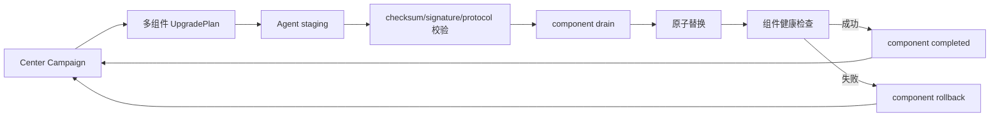

# Agent component upgrades

本文定义 `command-agent`、`desktop-companion`、`browser-agent` 的生产升级合同。三个 bundle 保持独立构建、独立目录、独立进程和独立回滚；它们共享同一台机器的 command 身份，不重新注册、不更换 Token。

## 当前边界

现有 Center 对旧 Release 仍兼容单个 `url + sha256`。新 Release 可附带
`remote-connect-mcp-manifest-vX.Y.Z.json`，由 Center 固化为一个 Campaign 的
多组件计划；新 Agent 先替换 command-agent，再独立 drain/替换
`desktop-companion` 和 `browser-agent`。伴侣缺失或失败只会让该组件失败，
不会回滚已经健康的 command-agent。Desktop/Browser 仍可通过安装脚本全量安装，
作为没有组件 Manifest 时的回退路径。

Manifest 最小形状如下：

```json
{
  "version": "vX.Y.Z",
  "components": [
    {
      "component": "desktop-companion",
      "version": "vX.Y.Z",
      "os": "windows",
      "arch": "amd64",
      "url": "https://github.com/ORG/REPO/releases/download/java-vX.Y.Z/desktop.zip",
      "sha256": "64-hex-digest",
      "bytes": 123456,
      "restart_policy": "drain-and-restart"
    }
  ]
}
```

Agent 从本机环境解析组件目标：
`REMOTE_CONNECT_MCP_DESKTOP_BINARY_PATH`、`REMOTE_CONNECT_MCP_BROWSER_BINARY_PATH`
及对应的 `*_SERVICE_NAME`。Manifest 不能注入远程目标路径；Browser 引擎
缓存、Playwright/Patchright/Comoufox runtime、Profile/Cookie 始终保持独立。

在组件升级协议上线前，不能把“command 升级完成”解释为 Desktop/Browser 已同步；升级页面必须分别显示三个组件版本和状态。

## Release Manifest

GitHub Actions 每个 Java Release 生成一个签名的 `release-manifest.json`。Center 只接受已验证的 Manifest，不允许 Console 直接提交任意下载地址。

```json
{
  "schema": 1,
  "version": "v0.0.0-main.149",
  "protocol_min": "v0.0.0-main.120",
  "components": {
    "command-agent": {
      "linux/amd64": {"url": "…", "sha256": "…", "bytes": 0},
      "linux/arm64": {"url": "…", "sha256": "…", "bytes": 0},
      "windows/amd64": {"url": "…", "sha256": "…", "bytes": 0}
    },
    "desktop-companion": {},
    "browser-agent": {}
  },
  "browser_runtime": {
    "engine": "playwright",
    "version": "1.63.0",
    "compatibility": "separate-cache-only"
  }
}
```

`browser_runtime` 不是 Native bundle 的一部分。浏览器引擎缓存、Playwright/Patchright/Comoufox 运行时和用户 Profile 必须保留独立生命周期。

控制台通过 `GET /api/v1/admin/releases/{version}/components` 读取经过 Center 校验的
Release Manifest，并在创建活动时提供“自动、仅 command-agent、按组件选择”三种入口。
选择结果以平台键写入 campaign；空组件列表明确表示该平台只升级 command-agent，避免
把“未选择 companion”误解为“自动补全”。
即使 command-agent 版本已经相同，只要目标平台存在非空 component plan，目标仍会进入
`pending` 并领取一次组件升级 offer；只有 command 和组件都没有工作时才会在创建阶段直接标记完成。

## 一个 Campaign，多组件状态

升级入口仍然是一个 machine-level Campaign，避免三个独立活动互相覆盖；但目标机内部按组件独立推进：



推荐的组件状态为：

```text
offered -> downloading -> staged -> draining -> installing -> restarting -> healthy
                                                            └-> failed -> rolled_back
```

状态、错误、attempt、旧版本和新版本均按 `machine_id + component` 保存。Desktop/Browser 失败不能让 command-agent 离线；command 失败也不能覆盖已经健康的 companion。

## 平台执行策略

| 组件 | Windows | Linux | 不变的内容 |
| --- | --- | --- | --- |
| command-agent | SYSTEM 服务的 detached helper 原子替换 | systemd 服务的 detached helper 原子替换 | `identity.json`、Agent Token、scope 配置 |
| desktop-companion | `RemoteConnectMCPDesktopCompanion` 登录任务，在用户 Session 重启 | systemd-user graphical session 重启 | 用户桌面会话、桌面 ACL、已登记 GUI 子进程 |
| browser-agent | Browser Worker drain 后替换 Native bundle | Browser Worker drain 后替换 Native bundle | Profile、Cookie、CDP 凭据、浏览器缓存 |

Agent 必须先把所选组件全部下载到 `state/upgrades/<campaign>/<attempt>/`，逐项校验后才停止进程。单组件采用 `.previous` 备份和原子 rename；失败只回滚该组件。

## Browser 特殊规则

Browser 升级拆成三类动作：

1. `browser-agent` Native bundle：由组件 Campaign 管理。
2. Browser runtime/engine：独立兼容矩阵和缓存目录，按显式 runtime upgrade 管理。
3. Profile/Cookie：不升级、不复制、不删除；只由用户会话和 Browser Worker 使用。

有活动浏览器任务时先 drain；任务完成或超时后再替换。没有桌面会话的主机仍可升级 headless Browser Agent。

## 无轮询与资源边界

- Center 通过现有长轮询/WebSocket wake-only 通道发送一次性 offer；不增加固定频率升级轮询。
- Agent 下载并发为 1，受总 bundle 大小、磁盘预留和单文件上限约束。
- 组件状态只在状态变化时上报，进度不是高频日志。
- 离线机器的目标行持久保留；下次心跳领取同一个 campaign/attempt，不重新生成 Enrollment Token。

## 实施顺序

1. 协议增加 `ComponentUpgradePlan`、Manifest、组件版本/状态和向后兼容的 command-only fallback。
2. Agent 将现有 detached updater 泛化为 component staging、drain、原子替换、健康检查和 rollback。
3. 增加 Windows scheduled task、Linux systemd-user、Browser Worker drain 适配。
4. Center/PostgreSQL 增加 campaign component/target component 表与并发锁。
5. React Console 增加组件版本、选择、canary、单组件重试/回滚。
6. GitHub Actions 生成三套 bundle、Manifest、SHA-256、SBOM、签名并做失败矩阵。

生产门禁至少覆盖：在线/离线 Agent、无桌面 Session、Desktop 任务运行中、Browser 任务运行中、单组件下载失败、磁盘不足、Center 重启、Agent 重启、旧 command-only Agent 兼容和回滚。
