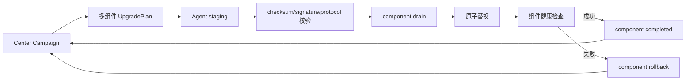

# Agent component upgrades

本文定义 `command-agent`、`desktop-companion`、`browser-agent` 和 `agent-updater` 的生产升级合同。四个 bundle 保持独立构建、独立目录、独立进程和独立回滚；它们共享同一台机器的 command 身份，不重新注册、不更换 Token。

## 当前边界

每个 Agent Release 附带
`remote-control-mcp-manifest-vX.Y.Z.json`，由 Center 固化为 Campaign 的多组件计划。
`command-agent` 安装包单独发布；Manifest 只列出可独立升级的 Desktop、Browser 和 updater，
并为每个受支持的平台提供一条计划。发布工作流检查平台矩阵；Center 拒绝缺失或无效的 Manifest。

旧 Agent 的 Campaign 先只包含 `command-agent` 更新；Agent 上报到兼容版本后，新建的
Campaign 才会包含 `agent-updater`。安装后，升级事务由独立的 `rcm-updater` 一次性处理，
它不驻留、不轮询。Agent 内置的兼容引导器只在 updater 缺失或需要替换自身时运行；
这样 Windows 不必覆盖正在运行的可执行文件。旧 Release 没有 updater 包时仍可首装，
之后由引导器完成迁移。

如果 Campaign 的 Agent 版本与本机相同，Agent 不下载、不替换 command-agent；updater
只安装所选组件，Agent 服务保持运行。只有 command-agent 版本发生变化时才停止并重启 Agent。

Manifest 使用 `components` 数组，`command-agent` 包不在数组中。简化后的结构如下；实际文件为每个平台分别列出 Desktop、Browser 和 updater：

```json
{
  "version": "vX.Y.Z",
  "components": [
    {
      "component": "agent-updater",
      "version": "v1.0.0+<updater-source-sha>",
      "os": "linux",
      "arch": "amd64",
      "url": "https://github.com/ORG/REPO/releases/download/java-vX.Y.Z/remote-control-mcp-updater-vX.Y.Z-linux-amd64.zip",
      "sha256": "64-hex-digest",
      "bytes": 123456,
      "restart_policy": "manual",
      "min_agent_version": "v0.1.36"
    }
  ]
}
```

Center 通过 HTTPS 读取并校验 Manifest 版本、平台、下载地址和摘要字段；Agent 下载后再校验包的 SHA-256，成功后才交给 updater 安装。

Agent 从本机环境解析组件目标：
`REMOTE_CONTROL_MCP_DESKTOP_BINARY_PATH`、`REMOTE_CONTROL_MCP_BROWSER_BINARY_PATH`
及 `REMOTE_CONTROL_MCP_AGENT_UPDATER_BINARY_PATH`，以及需要重启的组件对应的
`*_SERVICE_NAME`。Manifest 不能注入远程目标路径；Browser 引擎
缓存、Playwright/Patchright/Comoufox runtime、Profile/Cookie 始终保持独立。

不能把“command 升级完成”解释为其他组件已同步；升级页面必须分别显示 Agent、Desktop、Browser 和 updater 的组件状态。

## Release Manifest

GitHub Actions 每个 Java Release 生成并发布 `remote-control-mcp-manifest-vX.Y.Z.json`。
Center 按该文件创建不可变的组件计划；Console 不能提交任意下载地址。updater 自己的版本
只跟 updater 实现、运行时资源、构建配置和 `JsonCodec` 变化；测试与兼容门槛配置变动
不会触发机器重新下载同一二进制，Agent 其他代码变动也不会要求重装 updater。

`browser_runtime` 不是 Native bundle 的一部分。浏览器引擎缓存、Playwright/Patchright/Comoufox 运行时和用户 Profile 必须保留独立生命周期。

控制台通过 `GET /api/v1/admin/releases/{version}/components` 读取经过 Center 校验的
Release Manifest，并在创建活动时提供“自动、仅 command-agent、按组件选择”三种入口。
选择结果以平台键写入 campaign；空组件列表明确表示该平台只升级 command-agent，避免
把“未选择 companion”误解为“自动补全”。
即使 command-agent 版本已经相同，只要目标平台存在非空 component plan，目标仍会进入
`pending` 并领取一次组件升级 offer；只有 command 和组件都没有工作时才会在创建阶段直接标记完成。

## 一个 Campaign，多组件状态

升级入口仍然是一个 machine-level Campaign，避免三个独立活动互相覆盖；但目标机内部按组件独立推进：


```mermaid
flowchart LR
  C[Center Campaign] --> P[多组件 UpgradePlan]
  P --> S[Agent staging]
  S --> V[checksum/signature/protocol 校验]
  V --> D[component drain]
  D --> A[原子替换]
  A --> H[组件健康检查]
  H -->|成功| R[component completed]
  H -->|失败| B[component rollback]
  R --> C
  B --> C
```

推荐的组件状态为：

```text
offered -> downloading -> staged -> draining -> installing -> restarting -> healthy
                                                            └-> failed -> rolled_back
```

状态、错误、attempt、旧版本和新版本均按 `machine_id + component` 保存。单个组件失败不能让 command-agent 离线；command 失败也不能覆盖已经健康的 companion。

## 平台执行策略

| 组件 | Windows | Linux | 不变的内容 |
| --- | --- | --- | --- |
| command-agent | SYSTEM 服务的 detached helper 原子替换 | systemd 服务的 detached helper 原子替换 | `identity.json`、Agent Token、scope 配置 |
| agent-updater | 单次进程，无服务或计划任务 | 单次进程，无 systemd unit | 只在升级事务中运行；同版本且存在时跳过下载 |
| desktop-companion | `RemoteControlMCPDesktopCompanion` 登录任务，在用户 Session 重启 | systemd-user graphical session 重启 | 用户桌面会话、桌面 ACL、已登记 GUI 子进程 |
| browser-agent | Browser Worker drain 后替换 Native bundle | Browser Worker drain 后替换 Native bundle | Profile、Cookie、CDP 凭据、浏览器缓存 |

Agent 必须先把所选组件全部下载到 `state/upgrades/<campaign>/<attempt>/`，逐项校验后才停止进程。单组件采用 `.previous` 备份和原子 rename；失败只回滚该组件。

## Browser 特殊规则

Browser 升级拆成三类动作：

1. `browser-agent` Native bundle：由组件 Campaign 管理。
2. Browser runtime/engine：独立平台矩阵和缓存目录，按显式 runtime upgrade 管理。
3. Profile/Cookie：不升级、不复制、不删除；只由用户会话和 Browser Worker 使用。

有活动浏览器任务时先 drain；任务完成或超时后再替换。没有桌面会话的主机仍可升级 headless Browser Agent。

## 无轮询与资源边界

- Center 通过现有长轮询/WebSocket wake-only 通道发送一次性 offer；不增加固定频率升级轮询。
- Agent 下载并发为 1，受总 bundle 大小、磁盘预留和单文件上限约束。
- 组件状态只在状态变化时上报，进度不是高频日志。
- 离线机器的目标行持久保留；下次心跳领取同一个 campaign/attempt，不重新生成 Enrollment Token。

## 兼容迁移

1. 兼容版 Agent 先发布，升级器组件设置 `min_agent_version`，旧 Agent 只收到 command-agent 包。
2. 后续 Campaign 为兼容版机器安装 `rcm-updater`；升级器更新时用 Agent 内置的过渡执行路径替换当前正在运行的升级器。
3. 现场确认全机都有独立升级器后，再评估移除 Agent 内置过渡执行器；此前保留以支持长期离线后直接追上的机器。

生产门禁至少覆盖：在线/离线 Agent、旧版兼容门槛、升级器缺失、升级器自身替换、无桌面 Session、Desktop/Browser 任务运行中、单组件下载失败、磁盘不足、Center 重启、Agent 重启和单组件回滚。
