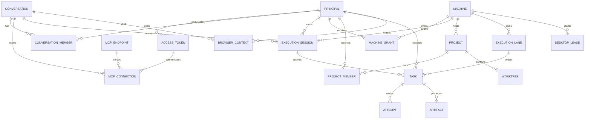

# M:M 用户、对话与 MCP 模型

版本：0.1

日期：2026-09-16（Asia/Shanghai）

状态：设计完成，尚未实现

本文把“多个用户、多个 Web 对话、多个 MCP 连接和多台终端”拆成独立关系。它是
`P2-05-lite` 的设计基线，不代表当前生产 Center 已经具备用户级隔离。当前生产仍然
可以使用单一兼容 MCP Token；在启用本设计前，使用同一个 Token 的调用者属于同一个
共享信任域。

## 1. 设计结论

1. **MCP 地址保持唯一且稳定。** 所有 Web 账号继续连接同一个 `/mcp`，Center、Console
   和 Agent 升级不改变连接器地址。
2. **Bearer Token 是当前唯一可信的调用主体来源。** MCP 协议不会自动向 Center 提供
   可验证的 ChatGPT 账号身份；请求中的 `conversation_id`、`chat_id` 或自定义标头只能
   用作关联信息，不能用作授权依据。
3. **一个用户可以有多个 Token、多个对话和多个连接。** Token 属于内部 `principal`，
   同一 Token 可以被该主体的多个 Web 对话使用；不同用户默认不能共享 Token。
4. **对话是上下文和生命周期边界，不是权限边界。** 权限由 Token、项目成员关系、
   机器授权和任务范围共同决定；对话只负责把一次 MCP 连接中的任务串起来。
5. **任务是持久化的一等对象。** MCP 请求只创建任务并返回 `task_id`；日志、工件、重试、
   取消和恢复都通过任务 ID 访问，不把长上下文留在 MCP 会话内。
6. **项目车道负责并发一致性。** 同一机器、项目/worktree/path 和能力形成执行车道；
   写任务默认独占车道，只读任务才允许有限并行。真正并行时使用不同 Git worktree。
7. **桌面和浏览器必须有会话隔离。** Desktop 使用独占桌面 lease；Browser 按主体和
   对话分配独立 Profile/Context，禁止不同主体意外共享 Cookie、下载目录或页面状态。
8. **这不是完整 SaaS 多租户。** 当前不引入 Center 多副本、跨组织计费或复杂 RBAC；
   只增加轻量主体、授权、审计、车道和配额能力。

## 2. 分层关系

```text
外部层：ChatGPT Web 账号/窗口
             |
             | 可能存在多个 Web 对话；账号标识不作为可信授权字段
             v
RCM 身份层：Principal <- Access Token（不透明 Bearer，可撤销）
             |
             +-- Conversation 1..N
             |       |
             |       +-- MCP Connection 1..N -> MCP Endpoint（固定 /mcp）
             |       +-- Execution Session 1..N
             |
             +-- Project ACL 1..N ---- Project/Worktree ---- Machine/Agent
                                      |
                                      +-- Execution Lane -> Task -> Attempt/Artifact
```

外部 ChatGPT 账号可以作为控制台录入的备注或显示名称，但不能假设 Center 能从 MCP
协议中验证该账号。真正的身份边界是 Token；Token 泄露后，泄露者拥有该 Token 所授予
的全部权限，因此必须支持撤销和最小范围。

## 3. 核心实体与基数



### 3.1 可视化关系图

为了避免实体关系被表格和文字淹没，下面两张图分别展示身份/连接关系和执行车道关系：

- [用户—对话—MCP 连接图（PNG）](diagrams/m2m-user-conversation-mcp.png) · [Mermaid 源码](diagrams/m2m-user-conversation-mcp.mmd)
- [多窗口—任务—执行车道图（PNG）](diagrams/m2m-execution-lanes.png) · [Mermaid 源码](diagrams/m2m-execution-lanes.mmd)

| 实体 | 关系 | 责任 | 重要约束 |
| --- | --- | --- | --- |
| `Principal` | 1:N Token、1:N 对话、M:N 项目 | RCM 内部的用户或服务主体 | 使用稳定内部 ID；不依赖 ChatGPT 账号字段 |
| `AccessToken` | N:1 Principal、1:N Connection | 不透明 Bearer 的哈希、范围和生命周期 | 只保存哈希；明文只显示一次；可过期、撤销、限流 |
| `Conversation` | M:N Principal、M:N Endpoint | Web 对话/工作上下文的关联 | 不是授权来源；可有多个 MCP 连接 |
| `MCPConnection` | N:1 Conversation、N:1 Endpoint、N:1 Token | 一次 Streamable HTTP MCP 连接 | 记录建立时间、最后活动和协议版本 |
| `ExecutionSession` | N:1 Conversation、N:1 Machine | 一组任务共享目标、范围和能力 | 绑定执行合同；过期后不能继续派发 |
| `MachineGrant` | M:N Principal、M:N Machine | 直接机器授权的最小范围投影 | 只有显式授权的主体才能看到/操作机器；项目授权可进一步收窄 |
| `Project/Worktree` | N:1 Machine、M:N Principal | 项目根目录和 Git 隔离工作树 | Agent 最终校验真实路径和符号链接 |
| `ExecutionLane` | N:1 Machine、1:N Task | 并发冲突和公平调度 | `lane_key` Center 派生，调用方不能任意指定 |
| `Task/Attempt` | N:1 Session、1:N Attempt | 异步执行、重试、取消和恢复 | 任务 ID 全局唯一；Attempt 受旧进程栅栏保护 |
| `BrowserContext` | N:1 Principal、N:1 Conversation | Cookie、Profile、下载和页面状态隔离 | 默认不跨主体共享；任务结束按策略清理 |
| `DesktopLease` | N:1 Machine | 鼠标、键盘和屏幕操作互斥 | 同一用户会话最多一个活动控制者 |

## 4. 三个并发场景

### 4.1 同一用户多开 Web 对话

- 使用同一个用户 Token，但每个窗口拥有独立的 `MCPConnection` 和 `Conversation`。
- 同一逻辑操作的重试复用原 `idempotency_key`；不同操作必须生成新的键。
- 同一项目和 worktree 的写任务进入同一车道，按队列顺序执行，不让两个窗口同时修改
  同一个 checkout。
- 需要并行时，为两个对话分配两个独立 worktree；任务完成后再由用户选择合并。
- 一个对话的任务输出不会自动注入另一个对话，避免 Web 上下文互相污染。

### 4.2 两个用户、两个 Web 账号

- 两个账号使用不同的 Token，Center 将请求映射到两个不同的 `Principal`。
- 两个主体可以分别拥有不同机器、项目和能力范围；任务、日志和工件默认按主体过滤。
- 如果两人共同处理一个项目，通过 `ProjectMember` 显式共享项目；同一 worktree 仍然走
  同一执行车道，两个 worktree 才能并行。
- 即使两个主体都被授予整机权限，也建议使用不同 Token，以便分别撤销、审计和限额。

### 4.3 两个用户共用同一个 Token

- Center 只能看到同一个 `Principal`，无法区分两个 Web 账号。
- 两人共享机器、项目、任务可见性和整机权限，属于明确的共享管理员域。
- 该模式只适合完全互信的临时协作；不能提供用户级审计、撤销或隔离。
- 不能把 Admin Token 或 Agent Token 当作解决方案；它们仍然不能识别 Web 用户。

## 5. 授权与执行规则

每个请求的有效权限取交集，而不是由单一字段覆盖：

```text
有效权限 = Token 范围
         ∩ Principal/Project ACL
         ∩ Machine/Agent 能力
         ∩ 当前 Task execution contract
```

1. `machines_list`、`project`、任务状态和工件列表只返回主体有权看到的投影。
2. `unrestricted` 必须同时满足 Token 能力和任务显式声明；普通项目 Token 不能升级为整机权限。
3. Agent 继续执行最终路径、进程、资源和桌面会话校验；Center 的主体授权不能替代本机校验。
4. `task_wait`、`task_output` 和 `task_cancel` 必须检查任务主体或共享项目 ACL，不能只凭任务 ID 放行。
5. 任务车道、用户队列和 Agent 总预算都由 Center/Agent 有界实现；任何通知丢失都通过任务 ID
   和游标恢复，不运行固定频率扫描。

## 6. 逻辑数据结构

以下是迁移设计的逻辑表，不是当前已部署的 SQL：

| 表 | 关键字段 | 关键唯一性/索引 |
| --- | --- | --- |
| `rcm_principal` | `principal_id`, `kind`, `display_name`, `status` | `principal_id`；状态和名称索引 |
| `rcm_mcp_token` | `token_id`, `principal_id`, `token_hash`, `expires_at`, `revoked_at`, `scope_json`, `quota_json` | `token_hash` 唯一；主体和有效状态索引 |
| `rcm_conversation` | `conversation_id`, `created_by`, `status`, `last_seen_at` | 主体和最近活动索引 |
| `rcm_mcp_connection` | `connection_id`, `conversation_id`, `endpoint_id`, `token_id`, `protocol_version` | 对话、Endpoint 和最后活动索引 |
| `rcm_machine_grant` | `machine_id`, `principal_id`, `scope_json`, `expires_at` | `(machine_id, principal_id)` 唯一；有效状态索引 |
| `rcm_project_member` | `project_id`, `principal_id`, `role`, `expires_at` | `(project_id, principal_id)` 唯一 |
| `rcm_execution_session` | `session_id`, `principal_id`, `conversation_id`, `machine_id`, `contract_json` | 主体/机器/状态索引 |
| `rcm_execution_lane` | `lane_id`, `machine_id`, `lane_key`, `active_task_id`, `lease_until` | `lane_key` 唯一；活动租约索引 |
| `rcm_task` | `task_id`, `principal_id`, `session_id`, `lane_id`, `idempotency_key`, `status` | `(principal_id, target_fingerprint, idempotency_key)` 唯一 |
| `rcm_browser_context` | `context_id`, `principal_id`, `conversation_id`, `profile_ref`, `lease_until` | 主体/对话/活动状态索引 |
| `rcm_desktop_lease` | `machine_id`, `os_session_ref`, `principal_id`, `lease_until` | 同一机器会话最多一个活动 lease |

Token、Cookie、完整命令、环境变量和页面内容不作为普通字段进入日志或指标标签。Token
只以哈希保存；`profile_ref` 只保存脱敏的本地引用，不保存 Cookie 或调试端口。

## 7. MCP 与控制台边界

为了保持 Web 上下文精简，不新增“每用户一套工具”或“每机器一套工具”：

- 继续使用现有 `machines_list`、`machine_info`、`project`、`command_start`、`desktop`、
  `browser`、`task_wait`、`task_output`、`task_cancel`；
- Center 从 Bearer Token 派生主体，不要求模型填写 `principal_id`；
- 对话和连接 ID 由 Center 生成并在任务摘要中返回，只有需要恢复时才由模型携带 `task_id`；
- 用户、Token、项目成员、配额和撤销放在 React Console/Admin API，不扩张 MCP 工具元数据；
- 任务结果只返回最小摘要、游标和工件引用，主体无权访问的内容在 Center 侧过滤。

## 8. 迁移和发布顺序

1. **兼容阶段**：把现有全局 MCP Token 映射为 `owner/shared-domain` 主体，保持旧连接器可用；
   不改变 `/mcp`、Agent Token 或机器身份。
2. **数据阶段**：通过 Liquibase 增加主体、Token、连接、项目成员、车道和任务归属字段；
   旧任务归属到兼容主体，先只记录不强制隔离。
3. **影子阶段**：控制台生成每用户 Token，双账号测试任务归属、ACL、车道和撤销；失败时仍可
   回到兼容主体。
4. **强制阶段**：启用主体过滤、项目 ACL、幂等键新唯一性、车道 lease、用户配额和 Browser/
   Desktop 会话隔离。
5. **收口阶段**：确认所有 Web 连接器已迁移后，再由管理员手动撤销全局共享 Token；不做自动
   轮换，不在 MCP 工具中提供 Token 轮换操作。

所有 Java、Native、React、Liquibase 集成和生产迁移仍只通过 GitHub Actions/GitOps 完成，
本机不编译、不直接改生产数据库。

## 9. 验收标准

- 两个不同 Token 可以同时连接同一个 `/mcp`，且任务和审计主体不同。
- 用户 A 不能读取或取消用户 B 的私有任务；共享项目按 ACL 可见。
- 相同主体的同一幂等键重试得到原任务，不同主体相同键不会冲突。
- 同一 worktree 的两个写任务严格串行；不同 worktree 可以在 Agent 资源预算内并行。
- 一个 Token 撤销后，其他主体的连接和任务不受影响。
- 两个 Browser Context 的 Cookie、下载和页面状态互不可见；Desktop lease 能阻止输入交错。
- Center 重启、WebSocket 丢通知和 ChatGPT 重试不破坏主体、任务、车道和游标关系。
- 日志、指标、MCP 返回和公开仓库均不出现 Token、Cookie、私有路径或完整敏感输出。

## 10. 明确不做

- 不从 ChatGPT 私有账号字段推断授权；
- 不建立每个用户/对话/机器一套 MCP 工具；
- 不把 Center 多副本、跨组织计费或复杂 SaaS RBAC 混入本次实现；
- 不把 MCP Token 传给 Agent；Agent 继续使用独立的机器 Token；
- 不用固定频率轮询解决多用户调度；
- 不把“共享 Token”描述成用户级隔离。
