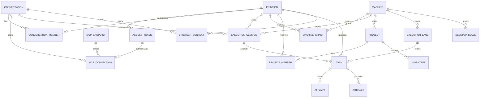

# M:M 用户、对话与 MCP 模型

版本：0.1

日期：2026-09-16（Asia/Shanghai）

状态：设计与代码实现完成；统一 GitHub Actions、目标机和双账号真实 Web 验收待进行

本文把“多个用户、多个 Web 对话、多个 MCP 连接和多台终端”拆成独立关系。它是
`P2-05-lite` 的设计基线。当前第一阶段已经把不透明 MCP Token 映射到 Principal，
并将主体、连接元数据、幂等键、READ/WRITE/EXCLUSIVE 执行车道、显式执行会话、任务专属结果通道、机器/项目 ACL、配额和会话最新合同接入任务生命周期；
会话访问时过期回收、Desktop lease 和 Browser Context/Profile 隔离已经实现。配置 MCP Token
只代表当前部署信任域；多用户场景使用 Console 签发的独立 Token。

## 1. 设计结论

1. **MCP 地址保持唯一且稳定。** 所有 Web 账号继续连接同一个 `/mcp`，Center、Console
   和 Agent 升级不改变连接器地址。
2. **Bearer Token 是当前唯一可信的调用主体来源。** MCP 协议不会自动向 Center 提供
   可验证的 ChatGPT 账号身份；请求中的 `conversation_id`、`chat_id` 或自定义标头只能
   用作关联信息，不能用作授权依据。
3. **一个用户可以有多个 Token、多个对话和多个连接。** Token 属于内部 `principal`，
   同一 Token 可以被该主体的多个 Web 对话使用；不同用户默认不能共享 Token。
4. **对话是上下文和生命周期边界，不是权限边界。** 权限由 Token、项目成员关系、
   机器授权和任务范围共同决定；对话只负责把一次 MCP 连接中的任务串起来。
5. **任务是持久化的一等对象。** MCP 请求只创建任务并返回 `task_id`；日志、工件、重试、
   取消和恢复都通过任务 ID 访问，不把长上下文留在 MCP 会话内。
6. **项目车道负责并发一致性。** 同一机器、项目/worktree/path 和能力形成执行车道；
   写任务默认独占车道，只读任务才允许有限并行。真正并行时使用不同 Git worktree。
7. **桌面和浏览器必须有会话隔离。** Desktop 使用独占桌面 lease；Browser 按主体和
   对话分配独立 Profile/Context，禁止不同主体意外共享 Cookie、下载目录或页面状态。
8. **这不是完整 SaaS 多租户。** 当前不引入 Center 多副本、跨组织计费或复杂 RBAC；
   只增加轻量主体、授权、审计、车道和配额能力。

## 2. 分层关系

```text
外部层：ChatGPT Web 账号/窗口
             |
             | 可能存在多个 Web 对话；账号标识不作为可信授权字段
             v
RCM 身份层：Principal <- Access Token（不透明 Bearer，可撤销）
             |
             +-- Conversation 1..N
             |       |
             |       +-- MCP Connection 1..N -> MCP Endpoint（固定 /mcp）
             |       +-- Execution Session 1..N
             |
             +-- Project ACL 1..N ---- Project/Worktree ---- Machine/Agent
                                      |
                                      +-- Execution Lane -> Task -> Attempt/Artifact
```

外部 ChatGPT 账号可以作为控制台录入的备注或显示名称，但不能假设 Center 能从 MCP
协议中验证该账号。真正的身份边界是 Token；Token 泄露后，泄露者拥有该 Token 所授予
的全部权限，因此必须支持撤销和最小范围。

## 3. 核心实体与基数



### 3.1 可视化关系图

为了避免实体关系被表格和文字淹没，下面两张图分别展示身份/连接关系和执行车道关系：

- [用户—对话—MCP 连接图（PNG）](diagrams/m2m-user-conversation-mcp.png) · [Mermaid 源码](diagrams/m2m-user-conversation-mcp.mmd)
- [多窗口—任务—执行车道图（PNG）](diagrams/m2m-execution-lanes.png) · [Mermaid 源码](diagrams/m2m-execution-lanes.mmd)

| 实体 | 关系 | 责任 | 重要约束 |
| --- | --- | --- | --- |
| `Principal` | 1:N Token、1:N 对话、M:N 项目 | RCM 内部的用户或服务主体 | 使用稳定内部 ID；不依赖 ChatGPT 账号字段 |
| `AccessToken` | N:1 Principal、1:N Connection | 不透明 Bearer 的哈希、范围和生命周期 | 只保存哈希；明文只显示一次；可过期、撤销、限流 |
| `Conversation` | M:N Principal、M:N Endpoint | Web 对话/工作上下文的关联 | 不是授权来源；可有多个 MCP 连接 |
| `MCPConnection` | N:1 Conversation、N:1 Endpoint、N:1 Token | 一次 Streamable HTTP MCP 连接 | 记录建立时间、最后活动和协议版本 |
| `ExecutionSession` | N:1 Conversation、N:1 Machine | 一组任务共享目标、范围和能力 | 绑定执行合同；过期后不能继续派发 |
| `MachineGrant` | M:N Principal、M:N Machine | 直接机器授权的最小范围投影 | 只有显式授权的主体才能看到/操作机器；项目授权可进一步收窄 |
| `Project/Worktree` | N:1 Machine、M:N Principal | 项目根目录和 Git 隔离工作树 | Agent 最终校验真实路径和符号链接 |
| `ExecutionLane` | N:1 Machine、1:N Task | 并发冲突和公平调度 | `lane_key` Center 派生，调用方不能任意指定 |
| `Task/Attempt` | N:1 Session、1:N Attempt | 异步执行、重试、取消和恢复 | 任务 ID 全局唯一；Attempt 受旧进程栅栏保护 |
| `BrowserContext` | N:1 Principal、N:1 Conversation | Cookie、Profile、下载和页面状态隔离 | 默认不跨主体共享；任务结束按策略清理 |
| `DesktopLease` | N:1 Machine | 鼠标、键盘和屏幕操作互斥 | 同一用户会话最多一个活动控制者 |

## 4. 三个并发场景

### 4.1 同一用户多开 Web 对话

- 使用同一个用户 Token，但每个窗口拥有独立的 `MCPConnection` 和 `Conversation`。
- 同一逻辑操作的重试复用原 `idempotency_key`；不同操作必须生成新的键。
- 同一项目和 worktree 的写任务进入同一车道，按队列顺序执行，不让两个窗口同时修改
  同一个 checkout。
- 需要并行时，为两个对话分配两个独立 worktree；任务完成后再由用户选择合并。
- 一个对话的任务输出不会自动注入另一个对话，避免 Web 上下文互相污染。

### 4.2 两个用户、两个 Web 账号

- 两个账号使用不同的 Token，Center 将请求映射到两个不同的 `Principal`。
- 两个主体可以分别拥有不同机器、项目和能力范围；任务、日志和工件默认按主体过滤。
- 如果两人共同处理一个项目，通过 `ProjectMember` 显式共享项目；同一 worktree 仍然走
  同一执行车道，两个 worktree 才能并行。
- 即使两个主体都被授予整机权限，也建议使用不同 Token，以便分别撤销、审计和限额。

### 4.3 两个用户共用同一个 Token

- Center 只能看到同一个 `Principal`，无法区分两个 Web 账号。
- 两人共享机器、项目、任务可见性和整机权限，属于明确的共享管理员域。
- 该模式只适合完全互信的临时协作；不能提供用户级审计、撤销或隔离。
- 不能把 Admin Token 或 Agent Token 当作解决方案；它们仍然不能识别 Web 用户。

## 5. 授权与执行规则

每个请求的有效权限取交集，而不是由单一字段覆盖：

```text
有效权限 = Token 范围
         ∩ Principal/Project ACL
         ∩ Machine/Agent 能力
         ∩ 当前 Task execution contract
```

1. `machines`、`project`、任务状态和工件列表只返回主体有权看到的投影；机器列表最多 25 条，项目列表不携带本地根路径，worktree 只给最多 10 条轻量摘要。
2. `unrestricted` 必须同时满足 Token 能力和任务显式声明；普通项目 Token 不能升级为整机权限。
3. Agent 继续执行最终路径、进程、资源和桌面会话校验；Center 的主体授权不能替代本机校验。
4. `task_read` 和 `task_cancel` 必须检查任务主体或共享项目 ACL，不能只凭任务 ID 放行。
5. 任务车道、用户队列和 Agent 总预算都由 Center/Agent 有界实现；任何通知丢失都通过任务 ID
   和游标恢复，不运行固定频率扫描。

## 6. 逻辑数据结构

以下是逻辑数据结构。当前轻量实现已通过 `015`–`020` 将主体、Token、任务归属、车道、执行会话、机器/项目 ACL、
文件传输元数据和配额投影落到 PostgreSQL；浏览器 Context 与 Desktop lease 仍以每个 Agent 的有界运行时状态实现，
不引入完整 SaaS 租户表：

| 表 | 关键字段 | 关键唯一性/索引 |
| --- | --- | --- |
| `rcm_principal` | `principal_id`, `kind`, `display_name`, `status` | `principal_id`；状态和名称索引 |
| `rcm_mcp_token` | `token_id`, `principal_id`, `token_hash`, `expires_at`, `revoked_at`, `scope_json`, `quota_json` | `token_hash` 唯一；主体和有效状态索引 |
| `rcm_conversation` | `conversation_id`, `created_by`, `status`, `last_seen_at` | 主体和最近活动索引 |
| `rcm_mcp_connection` | `connection_id`, `conversation_id`, `endpoint_id`, `token_id`, `protocol_version` | 对话、Endpoint 和最后活动索引 |
| `rcm_machine_grant` | `machine_id`, `principal_id`, `scope_json`, `expires_at` | `(machine_id, principal_id)` 唯一；有效状态索引 |
| `rcm_project_member` | `project_id`, `principal_id`, `role`, `expires_at` | `(project_id, principal_id)` 唯一 |
| `rcm_execution_session` | `session_id`, `principal_id`, `conversation_id`, `machine_id`, `contract_json` | 主体/机器/状态索引 |
| `rcm_execution_lane` | `lane_id`, `machine_id`, `lane_key`, `active_task_id`, `lease_until` | `lane_key` 唯一；活动租约索引 |
| `rcm_task` | `task_id`, `principal_id`, `session_id`, `lane_id`, `idempotency_key`, `status` | `(principal_id, target_fingerprint, idempotency_key)` 唯一 |
| `rcm_browser_context` | `context_id`, `principal_id`, `conversation_id`, `profile_ref`, `lease_until` | 主体/对话/活动状态索引 |
| `rcm_desktop_lease` | `machine_id`, `os_session_ref`, `principal_id`, `lease_until` | 同一机器会话最多一个活动 lease |

Token、Cookie、完整命令、环境变量和页面内容不作为普通字段进入日志或指标标签。Token
只以哈希保存；`profile_ref` 只保存脱敏的本地引用，不保存 Cookie 或调试端口。

## 7. MCP 与控制台边界

为了保持 Web 上下文精简，不新增“每用户一套工具”或“每机器一套工具”。列表和结果遵循固定预算：

- 机器发现只返回 `id/name/os/arch/version/capabilities/scope_mode/online` 等路由摘要；运行时预算、HostID、路径和心跳时间必须通过 `machines(operation=detail)` 按需获取；
- 项目发现只返回项目 ID、名称、默认 ref、worktree 数量和有限 worktree 摘要，不把本地 root/repository/path 或完整 worktree 历史带进对话；需要时显式调用 `project(operation=detail)` 分页获取详情，路径还必须传 `include_paths=true`；
- 任务输出继续使用字节游标分页；MCP 文本 JSON 设有最后防线，超过预算时要求使用游标或 Console 详情端点；
- 图片只有不超过 512 KiB 才内联，较大截图/下载只返回大小、MIME、SHA-256 和 Console 工件引用。

因此，MCP 是“摘要 + 句柄 + 游标”的控制通道，而不是日志、目录或工件浏览器：

- 使用固定的 `machines`、`command`、`desktop`、`browser`、`project`、`artifact`、
  `task_read`、`task_cancel` 聚合 Tool；
- Center 从 Bearer Token 派生主体，不要求模型填写 `principal_id`；
- 对话和连接 ID 由 Center 生成并在任务摘要中返回，只有需要恢复时才由模型携带 `task_id`；
- 用户、Token、项目成员、配额和撤销放在 React Console/Admin API，不扩张 MCP 工具元数据；
- 任务结果只返回最小摘要、游标和工件引用，主体无权访问的内容在 Center 侧过滤。

## 8. 发布顺序

1. **主体阶段（已完成）**：配置 MCP Token、用户 Token 和 Agent Token 使用独立身份；不把共享主体暴露给当前协议。
2. **数据阶段（已完成）**：通过 Liquibase 增加主体、Token、项目成员、车道、任务归属、执行会话和文件传输字段；历史共享主体由 `028-configured-principal-normalization` 收口。
3. **强制阶段（代码已完成）**：主体过滤、项目 ACL、主体维度幂等键、READ/WRITE/EXCLUSIVE 车道、用户配额和 Browser/Desktop 会话隔离默认生效。
4. **生产阶段（待验收）**：双账号/多窗口、断线重试、Center/Agent 重启和附件回显进入统一生产验收；不在 MCP Tool 中提供 Token 轮换操作。

所有 Java、Native、React、Liquibase 集成和生产迁移仍只通过 GitHub Actions/GitOps 完成，
本机不编译、不直接改生产数据库。

## 9. 验收标准

- 两个不同 Token 可以同时连接同一个 `/mcp`，且任务和审计主体不同。
- 用户 A 不能读取或取消用户 B 的私有任务；共享项目按 ACL 可见。
- 相同主体的同一幂等键重试得到原任务，不同主体相同键不会冲突。
- 同一 worktree 的两个写任务严格串行；不同 worktree 可以在 Agent 资源预算内并行。
- 一个 Token 撤销后，其他主体的连接和任务不受影响。
- 两个 Browser Context 的 Cookie、下载和页面状态互不可见；Desktop lease 能阻止输入交错。
- Center 重启、WebSocket 丢通知和 ChatGPT 重试不破坏主体、任务、车道和游标关系。
- 日志、指标、MCP 返回和公开仓库均不出现 Token、Cookie、私有路径或完整敏感输出。

## 10. 明确不做

- 不从 ChatGPT 私有账号字段推断授权；
- 不建立每个用户/对话/机器一套 MCP 工具；
- 不把 Center 多副本、跨组织计费或复杂 SaaS RBAC 混入本次实现；
- 不把 MCP Token 传给 Agent；Agent 继续使用独立的机器 Token；
- 不用固定频率轮询解决多用户调度；
- 不把“共享 Token”描述成用户级隔离。

## 11. 方案比较与最终选型

本节把可选方案和公开项目的实际模式放在同一张表中。WebCodex 更接近“真实主机上的
远程开发入口”：持久化 Server/Runner 可以承载多个项目，临时分享则收窄到单项目和短
生命周期；这说明“稳定服务端 + 可选范围收窄”比每次为项目创建一个新入口更适合长期使用。
参见 [WebCodex 仓库](https://github.com/yyjeqhc/webcodex)。

MCP 的新版 Streamable HTTP 规范允许一个 Endpoint 处理多个客户端连接，并要求服务端
自行校验 Origin 和认证；传输层连接或会话不能直接充当业务授权模型。参见
[MCP Streamable HTTP 规范](https://github.com/modelcontextprotocol/modelcontextprotocol/blob/main/docs/specification/2026-07-28/basic/transports/streamable-http.mdx)。

OpenHands 把客户端、Agent Server 和 Workspace 分开，事件通过 WebSocket 传递；它的
Runtime 文档把隔离、资源控制和可复现性作为独立层。Microsoft MCP Gateway 进一步采用
会话感知路由和生命周期管理，并明确建议多租户场景使用每会话沙箱。参见
[OpenHands Agent Server](https://docs.openhands.dev/sdk/guides/agent-server/overview)、
[OpenHands Runtime Architecture](https://docs.openhands.dev/openhands/usage/architecture/runtime)
和 [Microsoft MCP Gateway](https://github.com/microsoft/mcp-gateway)。

浏览器领域通常把短生命周期的 Session 与可复用的 Context/Profile 分开：Browserbase 的
Sessions/Contexts 设计允许并发浏览器，同时按 Context 持久化登录状态；E2B、Daytona
则把更强的 VM/沙箱隔离和会话级并发作为另一种运行时选择。参见
[Browserbase API](https://browserbase.mintlify.app/reference/api/overview)、
[Browserbase Context](https://www.browserbase.com/templates/context)、
[E2B Security](https://e2b.dev/security) 和 [Daytona Sandboxes](https://www.daytona.io/docs/sandboxes)。

| 方案 | 典型做法/参考 | 对 RCM 的优点 | 对 RCM 的代价或缺陷 | 结论 |
| --- | --- | --- | --- | --- |
| A. 全局共享 Bearer | 所有 Web 对话共用一个 Token | 最简单；适合单人或完全互信的管理员域 | 无法区分用户、撤销单个用户、做用户配额和审计；两个账号会互相看到任务 | 明确淘汰，不进入当前实现 |
| B. 每用户不透明 Bearer + Center ACL | Token 映射 `Principal`，Center 派生主体并过滤机器/项目/任务 | 保持一个固定 `/mcp`；可撤销、限额、审计；适配真实 Windows/Linux 主机；实现量可控 | 需要新增主体、Token、ACL 和任务归属表；共享项目需显式成员关系 | **选定为基础身份模型** |
| C. 每对话 Token/连接即权限 | 每个 Web 对话创建独立 Token 或独立服务入口 | 对话级配额和回收直观，误串话风险低 | ChatGPT Web 不一定提供可验证的稳定对话身份；Token 数量和连接器配置会爆炸；不利于固定 URL | 不作为认证模型；只把对话映射为内部 `ExecutionSession` |
| D. 每用户/每对话物理沙箱 | E2B/Daytona VM，或 OpenHands/MCP Gateway 的每会话 runtime | 隔离、资源上限、可复现性最好；适合不可信用户和高风险任务 | 启动/存储/网络成本高；无法自然控制用户正在登录的 Windows 桌面和本机 GUI；改变 RCM 的真实主机语义 | 作为可选运行时，不替代默认 Agent |
| E. OAuth/OIDC/企业 IdP | Gateway 通过 Entra/OIDC 发放委托 Token | 企业身份、统一撤销和组织联邦能力强 | 引入 IdP、动态注册、回调和更多运维面；不能单独解决 worktree、Desktop lease 或公平调度；与当前 ChatGPT DCR 问题冲突 | 预留适配器，当前不作为主路径 |
| F. 每用户/机器独立 MCP Endpoint | 为账号、机器或项目生成不同 URL | 路由和隔离容易理解；服务端逻辑较少 | URL/连接器数量随规模增长；升级、域名、故障恢复和用户体验变差；违背稳定 `/mcp` 目标 | 不采用 |
| G. 外置消息总线优先 | Redis/Kafka/NATS 负责任务队列、事件和锁 | 高吞吐、多副本和跨节点路由能力强 | 增加第二状态真相源和运维成本；当前单 Center + PostgreSQL 已能用行锁、`LISTEN/NOTIFY` 和有界队列完成需求 | 先不引入；达到明确吞吐/HA 指标再评估 |
| H. 完整 SaaS 多租户 | 组织、复杂 RBAC、计费、Center HA 和跨租户治理 | 产品化能力最完整 | 明显超出当前“可信用户控制自有机器”的需求；开发和验收面大幅膨胀 | 当前路线明确不做 |

### 11.1 最终选型：四层分离的轻量混合模型

RCM 采用 **B + C（内部会话）+ 可选 D** 的混合方案，但不采用 C 的“每对话凭证”和 D
的“默认沙箱”做法：

```text
认证层：opaque Bearer Token -> Principal
上下文层：Principal + Conversation -> ExecutionSession
资源层：MachineGrant/Project ACL -> Worktree/Path -> ExecutionLane
运行时层：command-agent；Desktop lease；Browser Context/Profile；可选 sandbox
```

具体规则如下：

1. **一个 Center、一个固定 `/mcp`。** 所有账号和窗口连接同一入口；协议层只提供精简、
   稳定的工具契约。
2. **Token 是用户边界，Conversation 是任务上下文。** Center 从 Bearer 查出
   `Principal`；不信任模型传入的 `principal_id`，也不把不可验证的 ChatGPT 账号字段当权限。
3. **每个对话在 Center 内生成 `ExecutionSession`。** 它保存目标机器、项目/worktree、
   范围、能力、预算和恢复游标；Web 重试只携带 `task_id`/幂等键，不携带长上下文。
4. **同一 worktree 通过派生车道串行，不同 worktree 才并行。** 车道键由机器、真实项目
   路径、worktree、能力和写入性质派生，调用方不能任意指定；用户配额和 Agent 总预算再做
   第二层有界约束。
5. **Desktop 与 Browser 是资源会话，不是新的用户身份。** Desktop 使用机器/OS 会话独占
   lease；Browser 为主体/对话分配 Context/Profile，Cookie、下载和页面状态不跨主体共享。
6. **沙箱是策略化运行时。** 默认仍在用户授权的真实主机执行，以满足 Windows GUI 和现有
   项目需求；未来对高风险或不可信任务，可在同一任务合同下选择 VM/容器/worktree sandbox，
   不改变 `/mcp`、Token 和任务 API。
7. **PostgreSQL 先作为唯一真相源。** Liquibase 持久化主体、Token 哈希、ACL、会话、车道、
   任务和游标；使用事务、行锁和 `LISTEN/NOTIFY`，不以固定周期轮询或额外消息总线作为基础依赖。
8. **配置主体只用于单一部署信任域。** 多用户场景使用 Console 签发的独立 Token；每个 Token
   都有主体、撤销、审计和配额边界。

### 11.2 为什么这是当前最优解

- **满足真实需求**：既能让多个 Web 账号和多个窗口共用一台真实机器，又能控制项目、worktree、
  桌面和浏览器资源；不强迫所有任务进入容器，也不牺牲无人值守任务的持久性。
- **不改变用户入口**：不用为每个用户重新创建 ChatGPT 连接器，Center/Agent 升级也不改变
  `/mcp`；新增用户只需生成和撤销自己的 Bearer Token。
- **上下文克制**：主体、ACL、会话和调度都在 Center/Console/数据库完成，MCP 只返回任务 ID、
  状态摘要、游标和工件引用，不把每台机器或每个用户复制成一套工具。
- **渐进式增强**：先完成轻量多主体和车道；需要更强隔离时增加 sandbox runtime，需要企业
  身份时增加 OAuth/OIDC adapter，需要更高吞吐时再评估消息总线，不推翻现有协议。
- **可验证、可回滚**：每一步都有主体、ACL、车道、租约、
  会话隔离和双账号端到端验收，不依赖“看起来已连接”作为成功标准。

因此，`P2-05-lite` 的实现基线更新为：**per-user opaque Bearer + Center-derived Principal +
per-conversation ExecutionSession + project/worktree ACL + derived execution lane + isolated
Desktop lease/Browser Context，sandbox/OAuth/broker 作为后续可插拔能力**。这也是本文件后续
数据迁移、API 和验收的唯一推荐路径。

## 12. 从明确需求反选设计

前面的身份模型解决“谁在调用”，但不能单独解决“多个调用如何稳定地作用于同一状态”。
按照真实需求反推，RCM 的一等执行抽象必须是 `ExecutionSession`、`WorkspacePolicy`、
`ExecutionLane` 和 `ResultChannel` 的组合，而不是把每个用户或每个对话拆成一个 MCP 服务。

### 12.1 需求到设计的映射

| 明确需求 | 必须保证的性质 | 选用设计 | 明确排除 |
| --- | --- | --- | --- |
| 多用户、多对话同时处理一个项目 | 任务可以并发提交，修改不会互相覆盖 | 默认每会话独立 worktree；需要共享状态时显式 `shared_serial` | 同一 checkout 的乐观并发写、自动隐式合并 |
| 多用户共同操作同一环境/终端 | 全局状态变更顺序可预测，进程互不劫持 | 每任务独立进程组/cwd/env；主机写车道串行；只读操作有限并行 | 为每个对话复制一套物理 Agent、共享一个持久 Shell |
| 对话结果不能乱串 | 一个结果只能被其任务句柄和授权主体读取 | `task_id + principal + session` 授权，任务专属序列游标，事件只按任务唤醒 | 信任 ChatGPT conversation_id、全局推送、按最近连接猜归属 |
| ChatGPT Web 超时、重试或断线 | 不能重复执行，能恢复原任务 | 持久任务/Attempt、幂等键、租约、游标和 PostgreSQL 真相源 | 同步等待 HTTP、内存队列作为唯一状态 |
| Web 上下文小 | 工具和返回值稳定、短小 | 固定 `/mcp`，任务 ID/摘要/工件引用，详情按需分页 | 每用户/每机器复制一套工具和完整日志 |
| Windows Desktop 与 Browser 同时可用 | GUI 状态不交错，凭据不串用 | Desktop OS 会话独占 lease；Browser 每主体/对话独立 Context/Profile | 多对话共用鼠标键盘或浏览器 Cookie |

这里有一个必须正面承认的工程事实：**同一个 checkout 上的两个写进程无法在不增加冲突
风险的前提下保证“真正同时修改”**。因此 RCM 把“同时处理”定义为“同时进入系统并可在
不同隔离单元执行”；如果用户要求共享同一状态，则用确定性的串行车道换取稳定性。

### 12.2 工作区和终端并发矩阵

| 目标关系 | 默认行为 | 可接受的并发 |
| --- | --- | --- |
| 同项目、同 worktree、写任务 | 进入同一 `lane_key` 排队 | 同时只有一个活动写任务 |
| 同项目、不同 worktree | 各自独立任务和输出 | 在 Agent/主体预算内并行，完成后显式合并 |
| 同项目、只读检查 | 使用一致性快照或只读车道 | 有界并行；不能把写入结果伪装成旧快照 |
| 同一终端、普通命令 | 每任务独立进程组和环境 | 独立只读可有限并行；主机全局写入串行 |
| 同一终端、持久终端/服务控制 | 使用 `host` 车道和明确 lease | 同一主机状态变更只有一个活动控制者 |
| 同一 OS 桌面会话 | `DesktopLease` | 一个活动输入控制者，其余排队或失败 |
| 同一机器浏览器 | 默认不同 Context/Profile | 不同 Context 并行；共享 Context 必须独占 |

### 12.3 结果路由和对话边界

任务创建时，Center 同时记录 `principal_id`、内部 `execution_session_id`、来源连接、
目标指纹和 `result_channel`。MCP 响应只返回不可预测的任务句柄和最小摘要：

1. `task_read`、`task_cancel` 必须带任务句柄；Center 检查主体、项目 ACL、
   会话能力和当前 Attempt，不接受只凭机器 ID 或猜测的任务查询；
2. 每个任务拥有独立的序列游标；WebSocket/`LISTEN/NOTIFY` 只发送“某任务有变化”的唤醒，
   不把输出内容广播到其他对话；
3. 同一主体的多个对话默认也不会收到彼此的主动结果。只有模型明确携带任务句柄，或项目
   成员通过显式共享，才可以读取另一个任务的摘要；
4. 网络重试只复用原幂等键和任务句柄，不能根据自然语言重新猜测“上一次任务”；
5. Center/Agent 重启后，结果仍从 PostgreSQL 的任务行和游标恢复，连接变化不会改变任务
   所属主体。

这个边界保证了“同一终端可以被多个对话使用”，同时保证每个对话只看到自己明确请求或
被授权共享的结果；它不依赖 ChatGPT 是否暴露稳定的私有 conversation ID。

### 12.4 需求驱动的最终结论

RCM 不是追求无限并发，而是追求 **可并发提交、按资源确定性调度、按任务精确回传**：

- 项目开发优先使用 `isolated` worktree，避免两个对话覆盖彼此的代码；
- 明确需要共同 checkout 时使用 `shared_serial`，让第二个写任务等待而不是冲突；
- 整机/环境模式使用 `host`，普通进程隔离，主机全局写入和桌面输入串行；
- 身份用每用户 Bearer，任务上下文用每对话 `ExecutionSession`，资源一致性用 Lane/Lease，
  结果隔离用任务句柄和专属游标；
- 沙箱、OAuth、消息总线仍然只是未来可插拔实现，不能替代上述基本不变量。
